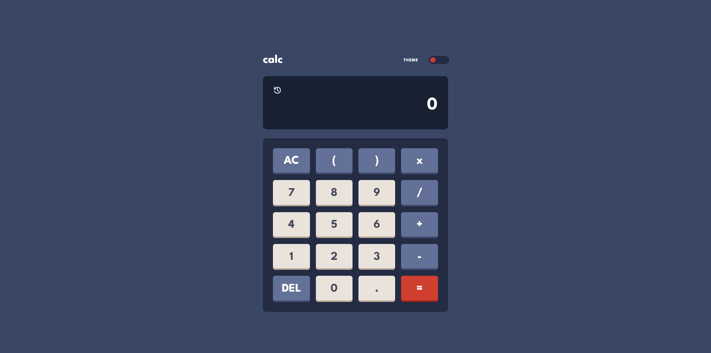
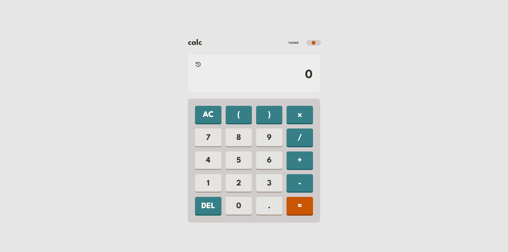

# Clones Calc
 My own project for a calculator. Took inspiration for it from the challenge offered from FrontendMentor. Decided I want to add on to it, give it more features. 

# Table of Contents
- [Clones Calc](#clones-calc)
- [Table of Contents](#table-of-contents)
- [Description](#description)
- [Features](#features)
- [Screenshots](#screenshots)

# Description
I created this little calculator both as a way to expand my javascript abilities, and just because I really enjoyed playing with it. It is meant to be functional in average use-case scenarios, while maintaining a clean, simple, and visually appealing design.

# Features
- Keyboard controls
- History
- Robust error handling
- Theme switching, with preference detection on first vist
- Ready for install via pwa Rich Install
- Mobile friendly
- Works offline if installed

# Screenshots

